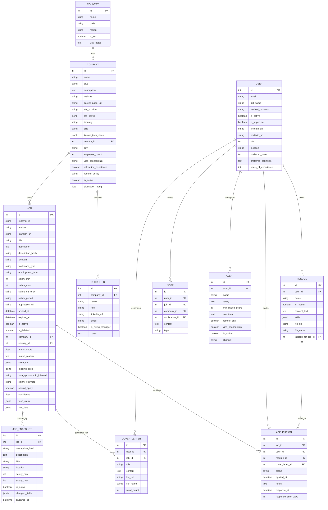

# Entity Relationship Diagram

```mermaid
erDiagram
    COUNTRY ||--o{ COMPANY : has
    COMPANY ||--o{ JOB : posts
    COMPANY ||--o{ RECRUITER : employs
    JOB ||--o{ APPLICATION : receives
    JOB ||--o{ JOB_SNAPSHOT : tracked_by
    JOB ||--o{ COVER_LETTER : generated_for
    USER ||--o{ RESUME : owns
    USER ||--o{ COVER_LETTER : generates
    USER ||--o{ APPLICATION : tracks
    USER ||--o{ NOTE : writes
    USER ||--o{ ALERT : configures
    RESUME ||--o{ APPLICATION : used_in

    COUNTRY {
        int id PK
        string name
        string code
        string region
        boolean is_eu
        text visa_notes
    }

    COMPANY {
        int id PK
        string name
        string slug
        text description
        string website
        string career_page_url
        string ats_provider
        jsonb ats_config
        string industry
        string size
        jsonb known_tech_stack
        int country_id FK
        string city
        int employee_count
        string visa_sponsorship
        boolean relocation_assistance
        string remote_policy
        boolean is_active
        float glassdoor_rating
    }

    JOB {
        int id PK
        string external_id
        string platform
        string platform_url
        string title
        text description
        string description_hash
        string location
        string workplace_type
        string employment_type
        int salary_min
        int salary_max
        string salary_currency
        string salary_period
        string application_url
        datetime posted_at
        datetime expires_at
        boolean is_active
        boolean is_deleted
        int company_id FK
        int country_id FK
        float match_score
        text match_reason
        jsonb strengths
        jsonb missing_skills
        string visa_sponsorship_inferred
        string salary_estimate
        boolean should_apply
        float confidence
        jsonb tech_stack
        jsonb raw_data
    }

    USER {
        int id PK
        string email
        string full_name
        string hashed_password
        boolean is_active
        boolean is_superuser
        string linkedin_url
        string portfolio_url
        text bio
        string location
        text preferred_roles
        text preferred_countries
        int years_of_experience
    }

    RESUME {
        int id PK
        int user_id FK
        string name
        boolean is_master
        text content_text
        jsonb skills
        string file_url
        string file_name
        int tailored_for_job_id FK
    }

    COVER_LETTER {
        int id PK
        int user_id FK
        int job_id FK
        string title
        text content
        string file_url
        string file_name
        int word_count
    }

    APPLICATION {
        int id PK
        int job_id FK
        int user_id FK
        int resume_id FK
        int cover_letter_id FK
        string status
        datetime applied_at
        text notes
        datetime response_at
        int response_time_days
    }

    RECRUITER {
        int id PK
        int company_id FK
        string name
        string role
        string linkedin_url
        string email
        boolean is_hiring_manager
        text notes
    }

    NOTE {
        int id PK
        int user_id FK
        int job_id FK
        int company_id FK
        int application_id FK
        text content
        string tags
    }

    ALERT {
        int id PK
        int user_id FK
        string name
        text query
        int min_match_score
        text countries
        boolean remote_only
        boolean visa_sponsorship
        boolean is_active
        string channel
    }

    JOB_SNAPSHOT {
        int id PK
        int job_id FK
        string description_hash
        text description
        string title
        string location
        int salary_min
        int salary_max
        boolean is_active
        jsonb changed_fields
        datetime captured_at
    }
```
